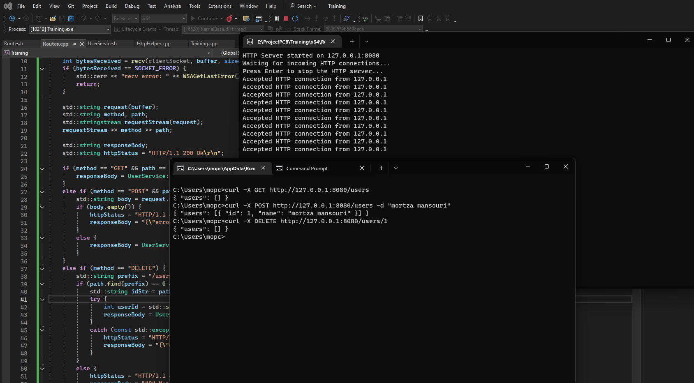

# ApiClient_Cpp

A C++ HTTP backend built using `curl` and `winsock2` libs.

## Challenge! Making a HTTP Client in cpp from BASE!

The goal is creating C++ backend with this features:

- ** Database Support **: Uses a JSON file for simplified data storage.
- ** Operations **: Ability to ADD/ REMOVE / View all data from the database.
- ** Simple Libraries **: Built with `LibCURL` and `ws2tcpip` (Winsock2) for setting up a TCP/HTTP server.
- ** Methods **: Supports basic methods  `GET`, `POST`, `PUT`.

## Developer

Developed by mortza mansouri.

## Image

